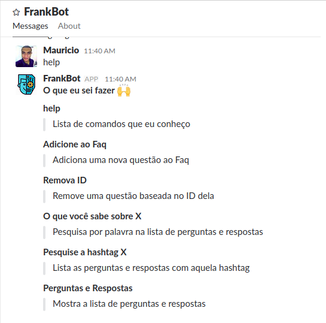
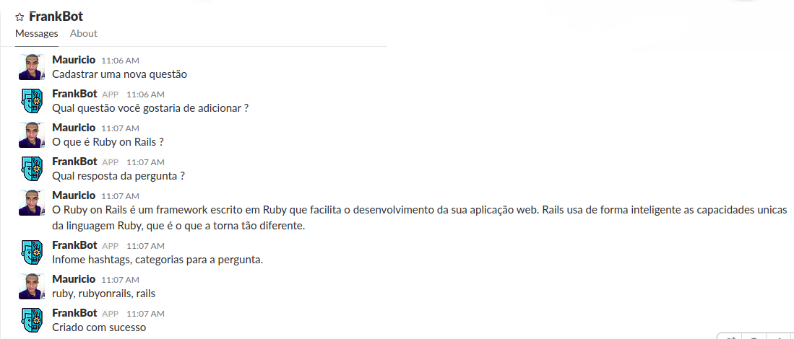
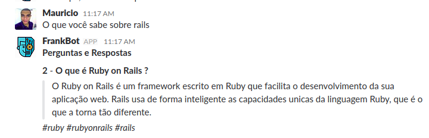
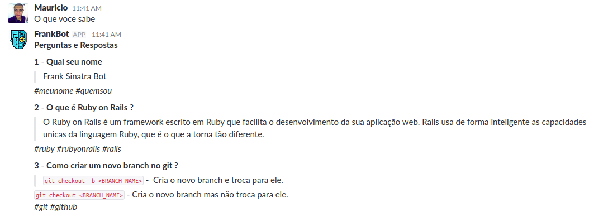
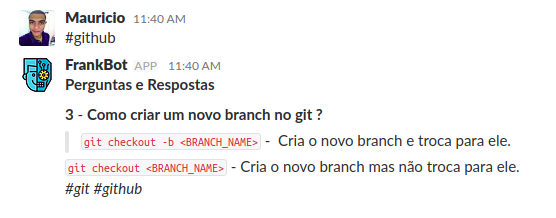

# FrankBot

FrankBot é um bot capaz de cadastrar e buscar perguntas frequentes de um time no slack.

## Aprendizados
- Sinatra - DialogFlow -SlackAPI - PGSearch

## O Bot
### - HELP

### - Cadastrando uma nova pergunta

### - Pesquisando uma pergunta

### - Listando todas as perguntas

### - Buscando por uma #hashtag

### - Quando uma pergunta não é encontrada é feita uma busca no google com a gem [FrankResearcher](https://github.com/mjunior/frank-researcher)

## TODO
- Possibilitar cadastro de vários times (Individual Companies)
- Monitorar conversas em canais
- Adicionar sistema de triggers para customizações diversas
